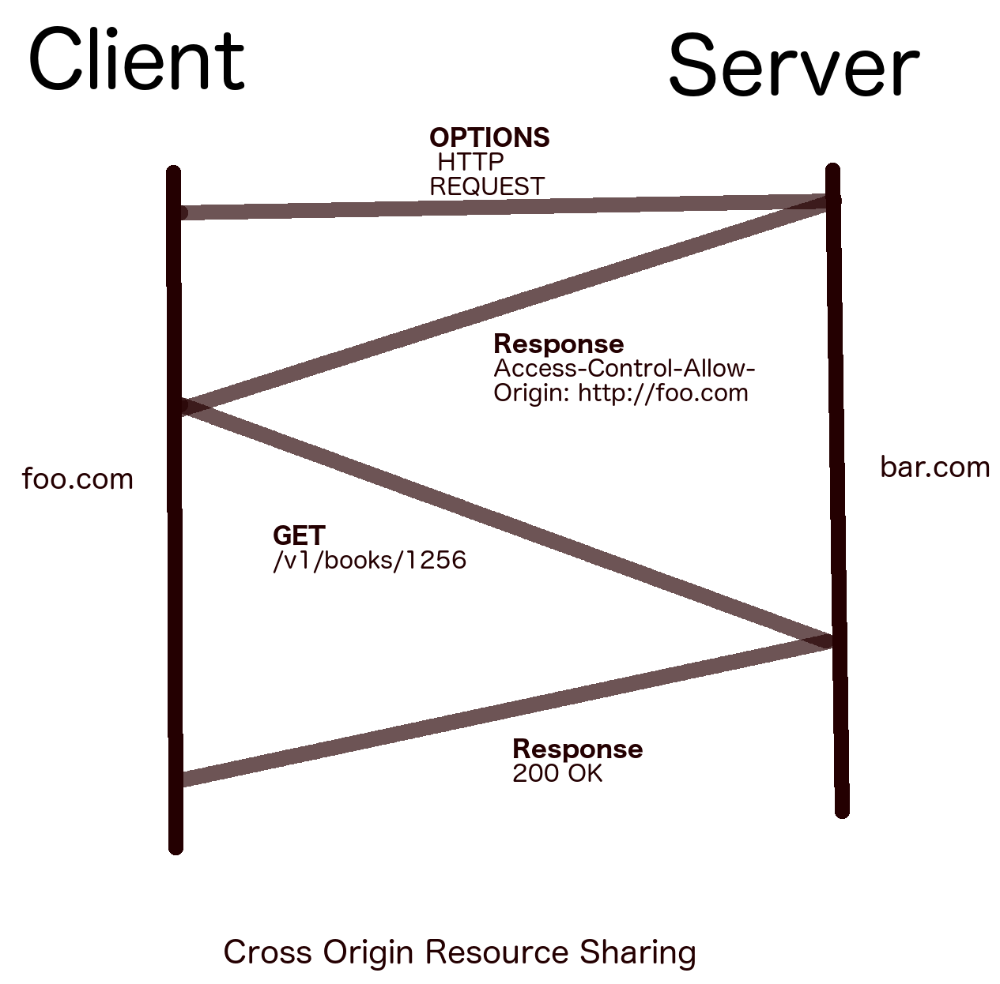

# REST的一些概念
# REST
    Representational State Transfer (REST) 代表性状态转移（REST）
    Command-Line Interface (CLI) 命令行接口
# REST服务的特点
    基于客户端-服务器的体系结构：该体系结构对于现代Web通过HTTP进行通信至关重要。 
    单个客户端服务器一开始可能看起来很幼稚，但是许多混合体系结构正在发展。 我们很快将讨论更多这些内容。
    无状态：这是REST服务的最重要特征。 REST HTTP请求包含服务器理解和返回响应所需的所有数据。 
    收到请求后，服务器将不记得该请求是否在一段时间后到达。 因此，该操作将是无状态的。
    可缓存的：为了很好地扩展应用程序，我们需要缓存某些响应。 可以缓存REST服务以提高吞吐量。
    资源表示：REST API提供了与之对话的统一接口。 它使用统一资源标识符（URI）映射资源（数据）。 
    它还具有请求特定数据的优点
    实现的自由：REST只是定义Web服务的一种机制。 它是一种可以以多种方式实现的体系结构样式。 
    由于这种灵活性，您可以按照自己的方式创建REST服务。 只要遵循REST的原则，您就可以自由选择服务器的平台或技术。
# REST动词和状态码
    动词          动作
    GET         从服务器获取记录或资源集
    OPTIONS     获取所有可用的REST操作
    POST        创建一个资源或一组新资源
    PUT         更新或替换给定记录
    PATCH       修改给定的记录
    DELETE      删除给定的资源

    状态码类型       号码范围            操作
    成功         200-226          2xx系列用于成功响应。
    错误      400-499（客户端）    4xx系列用于指示客户端错误。
            500-599（服务器）     5xx用于服务器无法处理请求。
    重定向     300-308             3xx系列用于URL重定向。

# GET
    PATH与QUERY-何时使用它们？ 根据经验，使用查询参数可根据查询参数获取多个资源。 
    如果客户端需要具有确切URI信息的单个资源，则可以使用PATH参数来指定资源。 
    例如，可以使用PATH参数来请求用户仪表板，并且可以使用QUERY参数来建模过滤时的提取数据。
    例子：
    GET /v1/books/?category=fiction&publish_date=2017

# POST和PUT和PATCH区别
    共同处：内容JSON放在body里传输
    不同处：
    POST是首次提交数据，创建（数据包含所有）
    PUT是对某些数据进行更新替换（数据包含所有）
    PATCH是对某些数据进行更新或新增（仅仅是新增或者删除的数据）

    POST /v1/books
    {"name" : "Lord of the rings", "year": 1954, "author" : "J. R. R. Tolkien"}
    PUT /v1/books/1256
    {"name" : "Lord of the rings", "year": 1955, "author" : "J. R. R. Tolkien"}
    PATCH /v1/books/1256
    {"isbn" : "0618640150"}

# DELETE and OPTIONS
    DELETE API方法用于从数据库中删除资源。 
    它与PUT相似，但没有主体。 它只需要删除资源的ID即可。 
    一旦资源被删除，后续的GET请求将返回404 not found状态。

    在API开发中，OPTIONS API方法被低估了。 给定资源后，此方法将尝试查找服务器上定义的所有可能的方法（GET，POST等）。 
    这就像在餐厅看菜单卡，然后订购可用的物品（而如果您随机订购的菜肴，服务员会告诉您它不可用）。 
    最佳做法是在服务器上实现OPTIONS方法。 从客户端，确保首先调用OPTIONS，并且如果该方法可用，则继续进行操作。

# 支持跨域资源分享(CORS)
    这种OPTIONS方法最重要的应用是跨源资源共享（CORS）。 
    最初，浏览器安全性阻止客户端发出跨域请求。 
    这意味着加载了www.foo.com URL的站点只能对该主机进行API调用。 
    如果客户端代码需要从www.bar.com请求文件或数据，则第二台服务器bar.com应该具有识别foo.com以获得其资源的机制。

    让我们检查前面的CORS图中遵循的步骤：
    foo.com在bar.com上请求OPTIONS方法
    bar.com向客户端发送诸如Access-Control-Allow-Origin：http://foo.com之类的标头
    接下来，foo.com可以访问bar.com上的资源，而没有任何调用任何REST方法的限制。

    如果bar.com希望在一个初始请求之后向任何主机提供资源，则可以将访问控制设置为*。